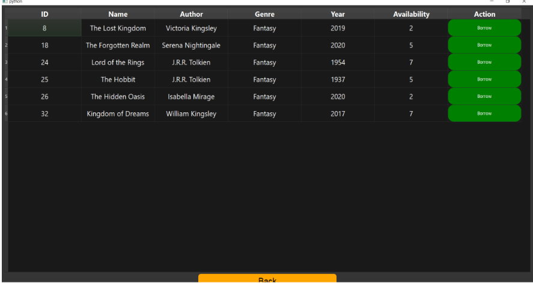

# Library Book Management System

[](https://www.python.org/)
[](https://www.sqlalchemy.org/)
[](https://www.riverbankcomputing.com/software/pyqt/)
[](https://www.microsoft.com/en-us/sql-server/)

## Project Overview

This project is a desktop application built with Python and PyQt5 that interacts with an MSSQL database to manage a library system.

Detailed report availabe in Report.pdf


## Key Features

* **User Authentication:**
    * Manager and Customer login pages with secure password handling (demonstrates data security awareness).
    * Customer registration functionality.
* **Book Management (Manager Side):**
    * **Find Books:** Search for books by name, genre, author, and publication year.
    * **Add Book:**  Functionality to add new books to the database.
    * **Edit Book:**  Modify existing book information.
    * **View Current Borrowers:**  See which customers currently have a specific book borrowed.
* **Customer Operations (Customer Side):**
    * **Find Books:** Search for available books to borrow.
    * **Borrow Books:**  Borrow books, updating book availability and recording borrowing history.
    * **Return Books:**  Return borrowed books, updating availability and recording return dates.
    * **View Borrowed Books:** See a list of currently borrowed books.
    * **Borrow History:**  View a history of all books borrowed by a customer.
* **Customer Management (Manager Side):**
    * **Find Customers:** Search for customers based on various criteria (ID, name, contact info, etc.).
    * **View Customer Book History:** (Through "Find Customers" and then "Books" button) - See borrowing history for individual customers.
* **Manager Management (Manager Side):**
    * **Add Manager:** Functionality to add new manager accounts.
* **Data Display:**  Uses PyQt5 `QTableWidget` to display data from the database in a structured and sortable table format.
* **Error Handling:**  Includes error handling and user feedback through message boxes (e.g., login status, input validation).


## Tools Used

* **Python:** Core programming language for the application logic and GUI.
* **PyQt5:**  Python library for creating the graphical user interface (GUI).
* **SQLAlchemy:** Python ORM (Object-Relational Mapper) for interacting with the MSSQL database. Provides a Pythonic way to write SQL queries and manage database operations.
* **MSSQL Server:** Relational database management system used to store library data.
* **pyodbc:** Python library for connecting to ODBC databases (used for MSSQL connectivity).


## Database Setup (MSSQL)

Before you run the Library Book Management System, you **must** set variables that tell the application how to connect to your MSSQL database using **Trusted Connection (Windows Authentication)**.

You need to set the following variables in the .env file and **save** the file:


*   **`DB_SERVER`**: The address or hostname of your MSSQL Server. This could be:
    *   `localhost` or `127.0.0.1` if your MSSQL Server is running on your local machine.
    *   The computer name of your MSSQL Server if it's on your local network (e.g., `DESKTOP-SERVER`).
    *   The IP address or hostname of your MSSQL Server if it's running remotely or in the cloud.
*   **`DB_NAME`**: The name of your MSSQL database (e.g., `LibraryDB`).

* **Ensure you have access to an MSSQL Server.**
* **Create an empty database** that you will use for this application. Note down the database name.
* **Run the provided `database_schema.sql` script** against your newly created database to create the necessary tables. This script is located in the root of the repository. You can use a tool like SQL Server Management Studio to execute the script.
* **Install Python Dependencies:**
    ```bash
    pip install -r requirements.txt
    ```



